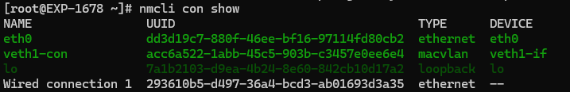
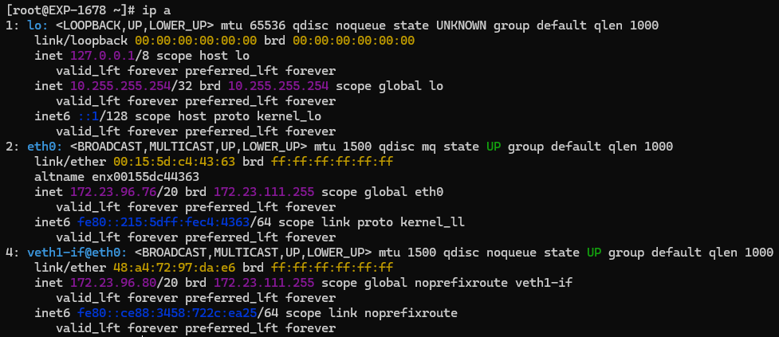

# Add a Virtual Ethernet Card vNIC in Linux

by Marcus Zou | Initialized: 21 April 2025 | Updated: 19 December 2025

[TOC]

## Intro

There is a chance that we need to migrate a license server from Windows Server to Linux Server to save some costs. It turns out the license server is associated to a specific MAC address. This is not an issue at all in Windows Server: add a legacy hardware, then NIC, specify the driver, etc ... it's easy.

In Linux, we can also add Virtual NIC and specify a MAC address for it.

Let's roll up sleeves and get hands dirty.

**Pre-requisites**:

- A Linux box, while a WSL in Windows may be preferred for testing purpose;

- A vNIC (Virtual NIC) must be in place;

- "**SLB_Licensing_2025.1_linux.tar.gz**" or likewise from Schlumberger website or a trustworthy source;

- A **lsb** package installed in Linux:
  ```shell
  # Debian/Ubuntu Linux
  apt install lsb-base
  # RedHat/Rocky/Oracle Linux
  dnf install lsb-release
  ## dnf install redhat-lsb
  ```

- Some knowledge of Linux system.


## Part 1 - Add a vNIC Temperately

a Virtual NIC is a must-have piece since the License file is associated with a specific MAC Address: `48:A4:72:97:DA:e6`, then let's shoot out.

```shell
# which architecture I am running on?
uname -a
# Load the module
modprobe dummy
# Create a dummy interface with name of eth1v since eth0 is the physical NIC
ip link add veth1 type dummy
# Assign a MAC Address to the device: veth1
ip link set dev veth1 address 48:A4:72:97:DA:E6

# Know current IP Address of the Physical NIC
ip a
#### inet 172.23.96.76/20 brd 172.23.111.255 scope global eth0

# Assign a similar IP address to the device: veth1
ip addr add 172.23.96.80/20 brd + dev veth1
# Bring it up
ip link set dev veth1 up
# Show case what NICs I have
ip a
```

Typically I have at least 3 NIC now: 

- `lo`: the loopback NIC
- `eth0`: the physical NIC
- `veth1`: the virtual NIC

```text
1: lo: <LOOPBACK,UP,LOWER_UP> mtu 65536 qdisc noqueue state UNKNOWN group default qlen 1000
    link/loopback 00:00:00:00:00:00 brd 00:00:00:00:00:00
    inet 127.0.0.1/8 scope host lo
       valid_lft forever preferred_lft forever
    inet 10.255.255.254/32 brd 10.255.255.254 scope global lo
       valid_lft forever preferred_lft forever
    inet6 ::1/128 scope host proto kernel_lo
       valid_lft forever preferred_lft forever
2: eth0: <BROADCAST,MULTICAST,UP,LOWER_UP> mtu 1500 qdisc mq state UP group default qlen 1000
    link/ether 00:15:5d:c4:47:a7 brd ff:ff:ff:ff:ff:ff
    altname enx00155dc447a7
    inet 172.23.96.76/20 brd 172.23.111.255 scope global eth0
       valid_lft forever preferred_lft forever
    inet6 fe80::215:5dff:fec4:47a7/64 scope link proto kernel_ll
       valid_lft forever preferred_lft forever
4: veth1: <BROADCAST,NOARP,UP,LOWER_UP> mtu 1500 qdisc noqueue state UNKNOWN group default qlen 1000
    link/ether 48:a4:72:97:da:e6 brd ff:ff:ff:ff:ff:ff
    inet 172.23.96.80/20 brd 172.23.111.255 scope global veth1
       valid_lft forever preferred_lft forever
    inet6 fe80::4aa4:72ff:fe97:dae6/64 scope link proto kernel_ll
       valid_lft forever preferred_lft forever
```

**Notes: How to remove a vNIC**

```shell
## nmcli dev delete <device-name>
ip link delete veth1
ip a
```


## Part 2 - Add a vNIC Permanently

a Virtual NIC is a must-have piece since the License file is associated with a specific MAC Address: `48:A4:72:97:DA:e6`, then let's shoot out with a permanent manner:

```shell
# Install `nmcli` and nmtui` as needed
dnf install -y NetworkManager NetworkManager-tui

# Check out what we have:
nmcli connection show
###
### NAME                UUID                                  TYPE      DEVICE
### eth0                dd3d19c7-880f-46ee-bf16-97114fd80cb2  ethernet  eth0
### lo                  7a1b2103-d9ea-4b24-8e60-842cb10d17a2  loopback  lo
### Wired connection 1  293610b5-d497-36a4-bcd3-ab01693d3a35  ethernet  --
###

# Create a connection with type of `macvlan`, named as `veth1-con` associated with the physical NIC `eth0`:
nmcli con add type macvlan con-name veth1-con ifname veth1-if dev eth0 mode bridge
### Output
### Connection 'veth1-con' (acc6a522-1abb-45c5-903b-c3457e0ee6e4) successfully added.

# Assign IP Address and gateway to the new conection: veth1-con
nmcli con mod veth1-con ipv4.addresses 172.23.96.80/20 ipv4.method manual
nmcli con mod veth1-con ipv4.gateway 172.23.96.1 ipv4.method manual

# Assgn specific MAC Address to the new connection: veth1-con, if needed
nmcli con mod veth1-con ethernet.cloned-mac-address 48:A4:72:97:DA:E6

# Activate the connection of the vNIC
nmcli con up veth1-con
### Output
### Connection successfully activated (D-Bus active path: /org/freedesktop/NetworkManager/ActiveConnection/32)
```

Heartbeat Checking: the connections

```shell
# Check the ststus of the connections
nmcli con show
```

The output shall bear the green-colored `veth1-con` as well as the physical NIC `eth0`:



Heartbeat Checking: the interfaces

```shell
# Check the ststus of the interfaces
ip a
```

The output shall showcase 3 interfaces: `lo`, `eth0`, and `veth1-if@eth0`:

```text
1: lo: <LOOPBACK,UP,LOWER_UP> mtu 65536 qdisc noqueue state UNKNOWN group default qlen 1000
    link/loopback 00:00:00:00:00:00 brd 00:00:00:00:00:00
    inet 127.0.0.1/8 scope host lo
       valid_lft forever preferred_lft forever
    inet 10.255.255.254/32 brd 10.255.255.254 scope global lo
       valid_lft forever preferred_lft forever
    inet6 ::1/128 scope host proto kernel_lo
       valid_lft forever preferred_lft forever
2: eth0: <BROADCAST,MULTICAST,UP,LOWER_UP> mtu 1500 qdisc mq state UP group default qlen 1000
    link/ether 00:15:5d:c4:4e:56 brd ff:ff:ff:ff:ff:ff
    altname enx00155dc44e56
    inet 172.23.96.76/20 brd 172.23.111.255 scope global noprefixroute eth0
       valid_lft forever preferred_lft forever
    inet6 fe80::13e2:cb6f:7172:9e05/64 scope link noprefixroute
       valid_lft forever preferred_lft forever
4: veth1-if@eth0: <BROADCAST,MULTICAST,UP,LOWER_UP> mtu 1500 qdisc noqueue state UP group default qlen 1000
    link/ether 48:a4:72:97:da:e6 brd ff:ff:ff:ff:ff:ff
    inet 172.23.96.80/20 brd 172.168.111.255 scope global noprefixroute veth1-if
       valid_lft forever preferred_lft forever
    inet6 fe80::ce88:3458:722c:ea25/64 scope link noprefixroute
       valid_lft forever preferred_lft forever
```



That's beautiful, isn't it?

**Note: remove the device or interface**

```shell
# Delete the device
nmcli device delete eth1
# Delete the connections against the UUID of the interfaces
nmcli connection delete 85d42fd0-c1a4-4fa1-825c-5cd3bd5820f8
```


## Part 3 - Install the SLB License Server

You may need to refer to the method to install SLB Licensing Server in Linux. This is not the important part of this writing. Then I'd ignore it.


## The End